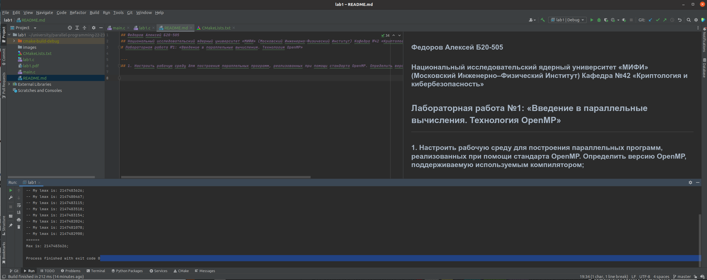
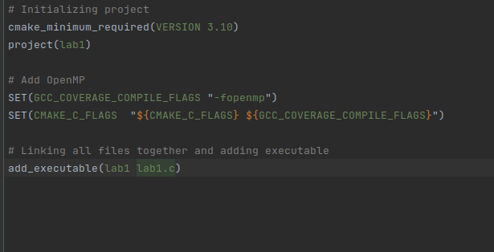
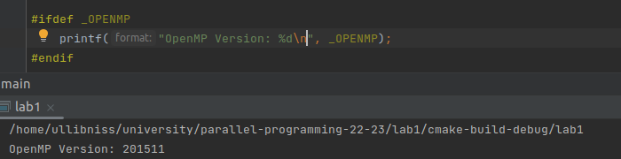
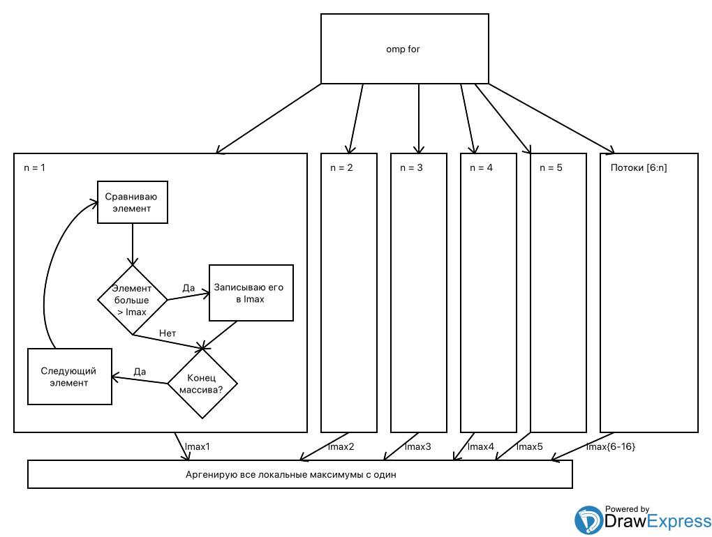
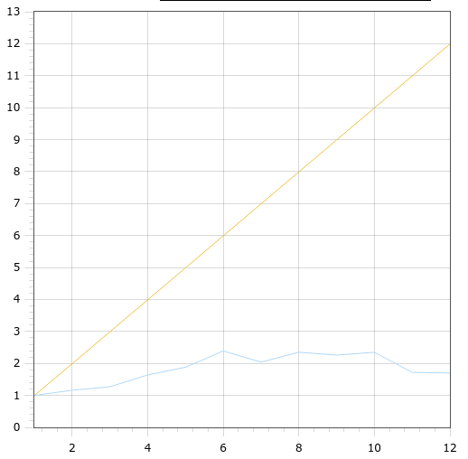
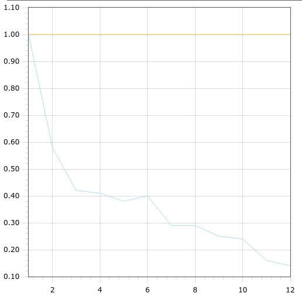

## Федоров Алексей Б20-505
## Национальный исследовательский ядерный университет «МИФИ» (Московский Инженерно–Физический Институт) Кафедра №42 «Криптология и кибербезопасность»
# Лабораторная работа №1: «Введение в параллельные вычисления. Технология OpenMP»

---
## 2. Настроить рабочую среду для построения параллельных программ, реализованных при помощи стандарта OpenMP. Определить версию OpenMP, поддерживаемую используемым компилятором;

Для лабораторной работы использовалась среда Jetbrains CLion IDE

Сборка происходит в помощью CMake

Версия OMP

Характеристики компьютера:
- Операционная система: Linux Ubuntu 20.04 x64
- Оперативная память: 16гб
- Процессор: AMD Ryzen 5 4600H with Radeon Graphics 86x
- Количество ядер: 6, обрабатывает в 12 потоков

## 3. Анализ приведённого алгоритма: описание принципа его работы. Блок-схема алгоритма. Для каждой директивы OpenMP указать: её смысл, область программного кода, на которую она распространяется, какую роль она играет в программе (и что бы было, если бы её не было);

### Приведенный алгоритм является алгоритмом нахождения максимума в массиве:

- **Принцип работы последовательного алгоритма**: массив произвольной длины прогоняется через for, каждый элемент сравнивается с максимумом. Если элемент большое максимума, он становиться максимумом. 
- **Принцип работы параллельного алгоритма**: массив произвольной длины прогоняется через for, итерации цикла равномерно разделяются по n потокам( omp for ). В каждом потоке находится локальный максимум. Потом находится глобальный максимум среди локальных ( с помощью reduction )

Блок схема:

### Смыслы директив

`#pragma omp parallel num_threads(threads) shared(array, count) reduction(max: max) default(none)`

- `pragma omp parallel` - директива, которая указывает начало параллельного участка программы. Если бы ее не было, алгоритм выполнялся бы последовательно
- `num_threads(threads)` - опция директивы parallel. Указывает количество потоков, которое нужно использовать. Если бы ее не было, использовалось бы дефолтное количество потоков( или заданное переменной окружения OMP_NUM_THREADS)
- `shared(array. count)` -  опция директивы parallel. Определяет общие переменные потоков. В данном случае array и count. Если бы ее не было, ничего бы не поменялось, тк array и count определены в последовательной части программы. Разве что из-за default(none) компилятор будет сыпать warning'ами.
- `reduction(max:max)` - опция директивы parallel. Инициализирует приватную переменную для каждого потока max ( которая справа )(это называется list, потому что в reduction какбы передается список из всех этих переменных), и применяет оператор max ( который слева ) на значения переменных в конце параллельного блока. Если бы ее не было, алгоритм бы не работал.
- `default(none)` - назначает по умолчанию зону видимости переменным, для которых явно она не указана. В данном случае none, ознвчает, что всем переменным нужно явно указать зону видимости.

`#pragma for` - директива, которая указывает, что for идущий после нее должен быть распараллелен по потокам. Если бы ее не было, вся конструкция потяряла бы смысл.

## 4. Графики: время работы, ускорение и эффективность в зависимости от числа процессоров. На графиках сравнить теоретические оценки с экспериментальными;

- **Теоретическое ускорение** считалось по формуле: S = N1/Np,  где N1 - количество операций сравнения при последовательном алгоритме, а Np - это количество операций сравнения при опработке на p потоках.
- **Экспериментальное ускорение** считалось аналогично теоретическому, но вместо количество операций сравнения - время.
- **Теоретическая и Экспериментальная эффективность** считалась по формуле E = S/p, где p - количество потоков.

Эксперимент проводился на 10 случайно сгенерированных массивах размером в 1000000 элементов( генерировал с помощью array_gen.py ). Массивы были сгенерированы 1 раз и использовались для всех p ( для удобвства написал скрипт lab1.sh).

### График ускорения:

### График эффективности:

- Желтый - теоретические значения
- Синий - экспериментальные значения

Из графиков можно увидеть, что теоретическая оценка совершенно не совпадает в экспериментальной.

Тем не менее можно сделать выводы, что не смотря на то, что процессор выполняет операции в 12 потоков, на 6 он показывает максимальное ускорение. Это логично, потому, что у него 6 ядер, а 12 потоков создаются програмно. И, в целом, с 1 до 6 потоков ускорение растет линейно.

Эффективность имеет обратно пропорциональную зависимость, это связано с тем, что с добавлением нового потока, операций управления потоками становиться больше.

## 5. Заключение: краткое описание проделанной работы;

В этой лабораторной работе я сравнивал последовательный и параллельный алгоритм нахождения максимума в массиве. Как выяснилось теоретические и практические данные сильно расходятся. На мой взгляд это потому, в теоретической оценке не учитываются операции управления многопоточностью.

## 6. Приложение: использованные в работе программные коды;

### [src](https://github.com/ullibniss/parallel-programming-22-23/tree/master/lab1)

## 7. Приложение: таблицы с теоретическими результатами и результатами вычислительных экспериментов.

### Теоретические данные

Количество потоков ->| 1      | 2      | 3      | 4      | 5      | 6      | 7      | 8      | 9      | 10     | 11    |12
---|--------|--------|--------|--------|--------|--------|--------|--------|--------|--------|-------|---
Количество операций сравнения на поток | 999999 | 500000 | 333334 | 250002 | 200003 | 166670 | 142862 | 125007 | 111118 | 100008 | 90919 | 83344
Ускорение | 1      | 1,99   | 2,99   | 3,99   | 4,99   | 5,99   | 6,99   | 7,99   | 8,99   | 9,99   | 10,99 | 11,99
Эффективность | 1      | ~1     | ~1     | ~1     | ~1     | ~1     | ~1     | ~1     | ~1     | ~1     | ~1    | ~1

### Экспериментальные данные

Количество потоков ->| 1 |2|3|4|5| 6    |7|8|9|10| 11   |12
---|---|---|---|---|---|------|---|---|---|---|------|---
Среднее время для 10 разный массивов мс | 13,40 | 11,51 | 10,52 | 8,14 | 7,10 | 5,61 | 6,56 | 5,70 | 5,92 | 5,71 | 7,80 | 7,89
Ускорение | 1 |  1,16 | 1,27 | 1,64 | 1,88 | 2,39 | 2,04 | 2,35 | 2,26 | 2,35 | 1,72 | 1,7
Эффективность | 1 | 0,58 | 0,42 | 0,41 | 0,38 | 0,4 | 0,29 | 0,29 | 0,25 | 0,24 | 0,16 | 0,14