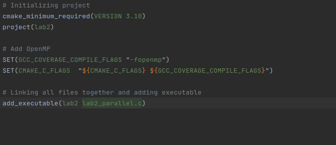
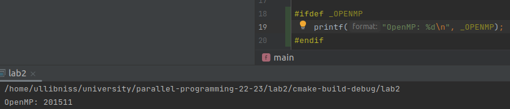
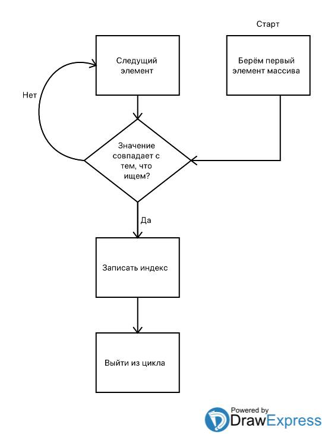

## Федоров Алексей Б20-505
## Национальный исследовательский ядерный университет «МИФИ» (Московский Инженерно–Физический Институт) Кафедра №42 «Криптология и кибербезопасность»

# Лабораторная работа: Лабораторная работа №2: «Выделение ресурса параллелизма. Технология OpenMP»

---

## 2. Описание используемой рабочей среды: модель процессора, объём и тип оперативной памяти, версия и разрядность операционной системы, используемая среда разработки, поддерживаемая ею версия OpenMP;

Для лабораторной работы использовалась среда Jetbrains CLion IDE

Сборка происходит в помощью CMake

Версия OMP

Характеристики компьютера:
- Операционная система: Linux Ubuntu 20.04 x64
- Оперативная память: 16гб
- Процессор: AMD Ryzen 5 4600H with Radeon Graphics 86x
- Количество ядер: 6, обрабатывает в 12 потоков

## 3. Блок-схема последовательного алгоритма, описание принципа его работы;

Последовательный алгоритм очень примитивен: он просто перебирает массив до тех пор, пока не найдет нужный элемент.

**Важный нюанс**: мы ищем первое вхождение

Блок схема:

## 4. Описание директив и функций OpenMP, применённых при создании параллельной программы. Обоснование их применения;

Реализация параллельного алгоритма зависит от того, ищем мы первое или последнее вхождение.

Принцип работы параллельного алгоритма: for распараллеливается на n потоков. В каждом потоке ищется локальный индекс. А потом, в зависимости от вхождения, которое мы ищем, нужно найти минимум или максимум среди локальных.

Использую эти директивы:
- `#pragma omp parallel default(none) shared(array, count, target) reduction(min:index)`
  - `opm parallel` - понятно )
  - `default(none)` - отменяет автоопределение класса, чтобы сделать это руками ( на самом деле добавил, потому что IDE ругается )
  - `shared(array, count, target)` - определяем общие переменные
  - `reduced(min:index)` - определяем список из приватных локальных переменных `index` и находим минимум среди них.

- `#pragma omp for` - рапараллеливаем for