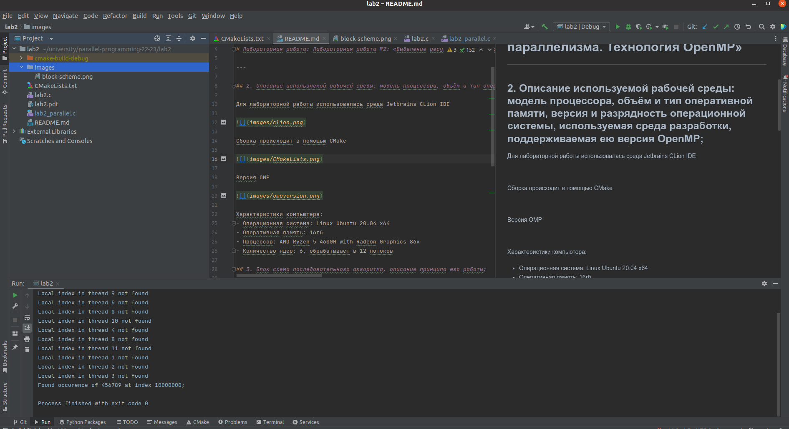

## Федоров Алексей Б20-505
## Национальный исследовательский ядерный университет «МИФИ» (Московский Инженерно–Физический Институт) Кафедра №42 «Криптология и кибербезопасность»

# Лабораторная работа: Лабораторная работа №2: «Выделение ресурса параллелизма. Технология OpenMP»

---

## 2. Описание используемой рабочей среды: модель процессора, объём и тип оперативной памяти, версия и разрядность операционной системы, используемая среда разработки, поддерживаемая ею версия OpenMP;

Для лабораторной работы использовалась среда Jetbrains CLion IDE

Сборка происходит в помощью CMake

Версия OMP

Характеристики компьютера:
- Операционная система: Linux Ubuntu 20.04 x64
- Оперативная память: 16гб
- Процессор: AMD Ryzen 5 4600H with Radeon Graphics 86x
- Количество ядер: 6, обрабатывает в 12 потоков

## 3. Блок-схема последовательного алгоритма, описание принципа его работы;

Последовательный алгоритм очень примитивен: он просто перебирает массив до тех пор, пока не найдет нужный элемент.

**Важный нюанс**: мы ищем первое вхождение

Блок схема:

## 4. Описание директив и функций OpenMP, применённых при создании параллельной программы. Обоснование их применения;

Реализация параллельного алгоритма зависит от того, ищем мы первое или последнее вхождение.

Принцип работы параллельного алгоритма: for распараллеливается на n потоков. В каждом потоке ищется локальный индекс. А потом, в зависимости от вхождения, которое мы ищем, нужно найти минимум или максимум среди локальных.

Использую эти директивы:
- `#pragma omp parallel default(none) shared(array, count, target) reduction(min:index)`
  - `opm parallel` - понятно )
  - `default(none)` - отменяет автоопределение класса, чтобы сделать это руками ( на самом деле добавил, потому что IDE ругается )
  - `shared(array, count, target)` - определяем общие переменные
  - `reduced(min:index)` - определяем список из приватных локальных переменных `index` и находим минимум среди них.

- `#pragma omp for` - рапараллеливаем for

## 5. Графики: время работы, ускорение и эффективность в зависимости от числа процессоров. На графиках сравнить теоретические оценки с экспериментальными;

### График ускорения

### График эффективности

**Желтый** - Теоретические значения 
**Синий** - Экспериментальные значения

## 6. Заключение: краткое описание проделанной работы;

В этой лабораторной работе проверил эффективность распараллеливания алгоритма поиска первого вхождения элемента. Из графиков видно, что до 10 ядер эффективность растет, но на 11 ядрах количество операций паспараллеливания становиться слишком велико и эффективность падает.

## 7. Приложение: использованные в работе программные коды;

### [src](https://github.com/ullibniss/parallel-programming-22-23/tree/master/lab2)

## 8. Приложение: таблицы с результатами вычислительных экспериментов.

### Теоретические значения

Количество потоков | 1        | 2       | 3       | 4       | 5       | 6       | 7       | 8       | 9       | 10      | 11      |12
---|----------|---------|---------|---------|---------|---------|---------|---------|---------|---------|---------| ---
Среднее количество операций в худшем случае | 10000000 | 5000001 | 3333335 | 2500004 | 2000004 | 1666672 | 1428578 | 1250007 | 1111119 | 1000009 | 9909101 | 833345
Ускорение | 1        | 1,99    | 2,99    | 3,99    | 4,99    | 5,99    | 6,99    | 7,99    | 8,99    | 9,99    | 10,99   |11,99
Эффективность | 1        |1|1|1|1|1|1|1|1|1|1|1

### Экспериментальные значение

Количество потоков | 1    | 2     |3|4|5|6|7| 8    |9|10| 11   |12
---|------|-------|---|---|---|---|---|------|---|---|------| ---
Среднее затраченное время, мс | 19,9 | 16,48 | 14,82 | 12,42 | 10,59 | 9,99 | 9,47 | 8,01 | 7,84 | 7,52 | 8,04 | 8,19
Ускорение | 1    | 1,21  | 1,34 | 1,6 | 1,87 | 1,99 | 2,10 | 2,49 | 2,54 | 2,64 | 2,47 | 2,43 
Эффективность | 1    | 0,61 | 0,45 | 0,4 | 0,38 | 0,33 | 0,3 |  0,31 | 0,28 | 0,26 | 0,23 | 0,2