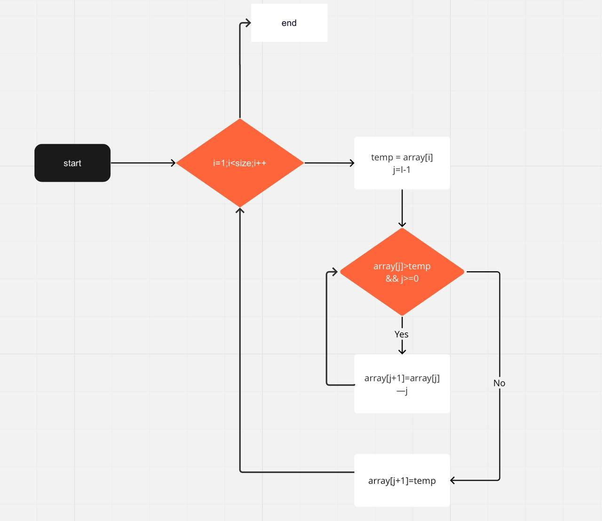
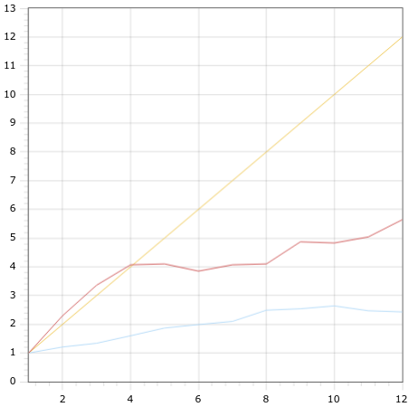
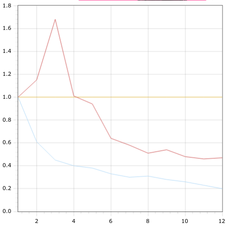

## Федоров Алексей Б20-505
## Национальный исследовательский ядерный университет «МИФИ» (Московский Инженерно–Физический Институт) Кафедра №42 «Криптология и кибербезопасность»

# Лабораторная работа №3: «Реализация алгоритма с использованием технологии OpenMP»

---

## 2. Описание используемой рабочей среды: модель процессора, объём и тип оперативной памяти, версия и разрядность операционной системы, используемая среда разработки, поддерживаемая ею версия OpenMP;

Для лабораторной работы использовалась среда Jetbrains CLion IDE

Сборка происходит в помощью CMake

Версия OMP

Характеристики компьютера:
- Операционная система: Linux Ubuntu 20.04 x64
- Оперативная память: 16гб
- Процессор: AMD Ryzen 5 4600H with Radeon Graphics 86x
- Количество ядер: 6, обрабатывает в 12 потоков

## 3. Блок-схема последовательного алгоритма, описание принципа его работы;

Алгоритм Шелла работает следущим образом: 

## 4. Описание директив и функций OpenMP, применённых при создании параллельной программы. Обоснование их применения;

Использовались 2 директивы openMP

- `#pragma omp parallel default(none) shared(array, count) num_threads(procs)`
  - `omp parallel` - директива для распараллеливания
  - `default(none)` - говорим, что уровень доступности всех должен быть указан явно
  - `shared(array, count)` - указываем, что наш массим и размер - общие для всех потоков
  - `num_threads(procs)` - указываем число потоков, которые используем. Это нужно для того, чтобы мы могли контролировать это количество для замерения экспериментальных данных

- `#pragma omp for` - нужна для распараллеливания for.

Мною было решено, что эффективнее всего будет распараллелить тот участок кода, где производится перестановка согласно шагу.

Это связано с тем, что в виду соблюдения шага, для каждой перестановки будут задействованы разные участки памяти.

## 5. Графики: время работы, ускорение и эффективность в зависимости от числа процессоров. На графиках сравнить теоретические оценки с экспериментальными;

Граффик ускорения:

Граффик эффективности:

Желтый - теоретические данные
Синий - Экспериментальные данные для случайно сгенерированных массивов размером 100млн
Красный - Экспериметнальные данные для массива с одинаковыми элементами.

## 6. Заключение: краткое описание проделанной работы;

В этой работе я проверил работу openMP на примере сортировки Шелла. Для этого использовалось два вида массивов: случайно сгенерированные и состоящие из одинаковых элементов

Из полученных экспериментальных данных можно сделать вывод, что для массива из одинаковых элементов распараллеливание сортировки Шелла просшло эффективнее.

## 7. Приложение: использованные в работе программные коды;

### [src](https://github.com/ullibniss/parallel-programming-22-23/tree/master/lab3)

## 8. Приложение: таблицы с результатами вычислительных экспериментов.

### Теоретические значения

Общее количество операций перестановок N^(3/2)

Количество потоков | 1      | 2     | 3     | 4     | 5     | 6       | 7       | 8       | 9       | 10    | 11     |12
---|--------|-------|-------|-------|-------|---------|---------|---------|---------|-------|--------| ---
Количеств операций перестановки на поток | 100млн | 50млн | 33млн | 25млн | 20млн | 1б,6млн | 14,2млн | 12,5млн | 11,1млн | 10млн | 9,1млн | 8,3млн
Ускорение | 1      | 2     | 3     | 4     | 5     | 6       | 7       | 8       | 9       | 10    | 11     | 12
Эффективность | 1      | 1     | 1     | 1     | 1     | 1       | 1       | 1       | 1       | 1     | 1      | 1

### Экспериментальные значения

Количество потоков | 1    | 2    | 3    | 4    | 5    | 6    | 7    | 8    | 9    | 10   | 11   |12
---|------|------|------|------|------|------|------|------|------|------|------| ---
Среднее затраченное время, с | 5,67 | 3.03 | 2.28 | 1.84 | 1.69 | 1.69 | 1.55 | 1.4  | 1.27 | 1.19 | 1.28 | 1.30
Ускорение | 1    | 1,21 | 1,34 | 1,6  | 1,87 | 1,99 | 2,10 | 2,49 | 2,54 | 2,64 | 2,47 | 2,43
Эффективность | 1    | 0,61 | 0,45 | 0,4  | 0,38 | 0,33 | 0,3  | 0,31 | 0,28 | 0,26 | 0,23 | 0,2

### Экспериментальное значение для массивов из одинаковых элементов

Количество потоков | 1     | 2    | 3    | 4    | 5    | 6    | 7    | 8    | 9    | 10   | 11   |12
---|-------|------|------|------|------|------|------|------|------|------|------| ---
Среднее затраченное время, с | 0,575 | 0,25 | 0,171 | 0,141 | 0,122 | 0,149 | 0,141 | 0,140  | 0,118 | 0,119 | 0,114 | 0,102
Ускорение | 1     | 2,3  | 3,36 | 4,07 | 4,71 | 3,85 | 4,07 | 4,10 | 4,87 | 4,83 | 5,04 | 5,64
Эффективность | 1     | 1,15 | 1,68 | 1,01  | 0,94 | 0,64 | 0,58 | 0,51 | 0,54 | 0,48 | 0,46 | 0,47
