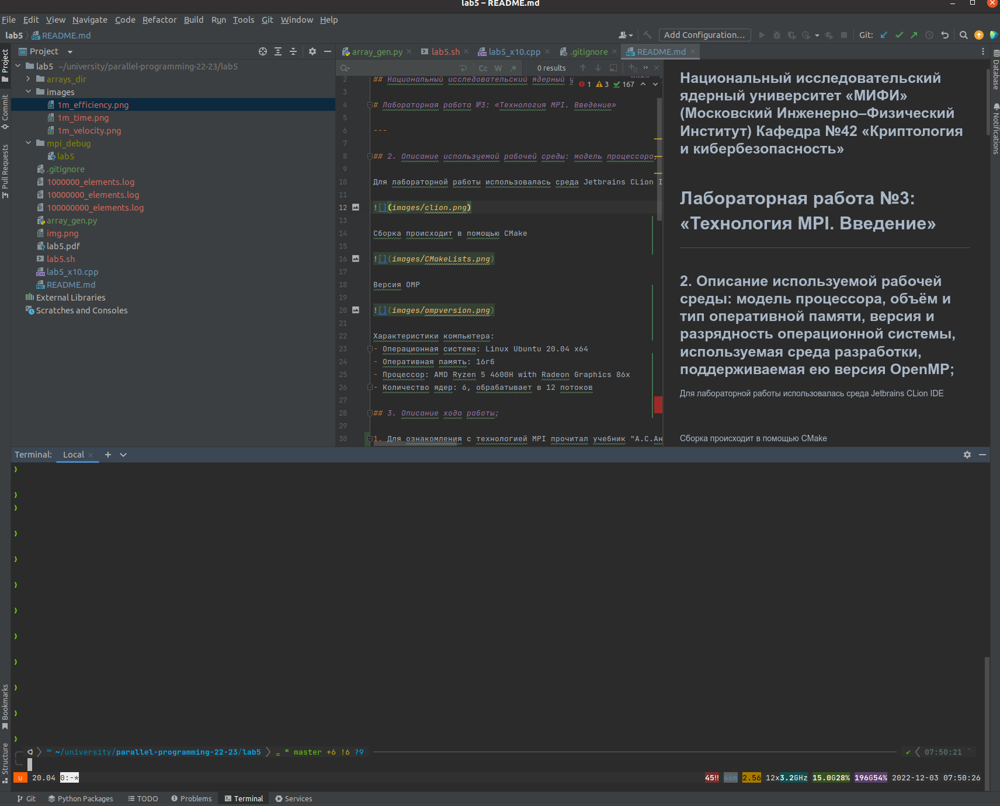
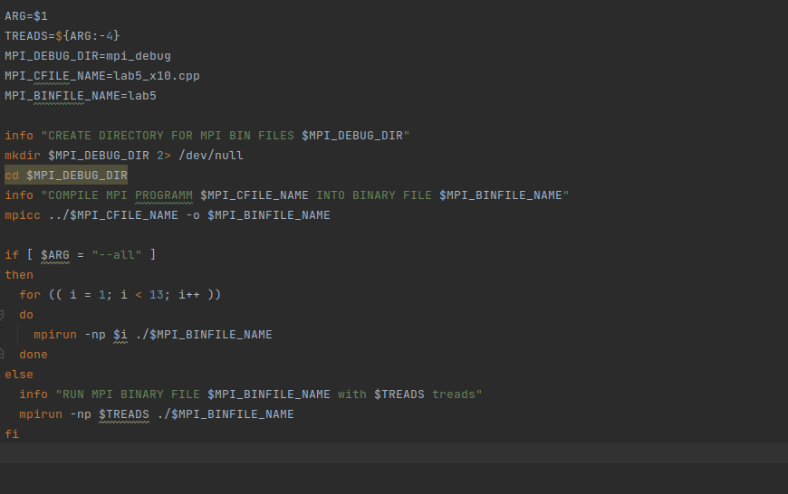
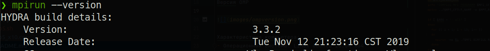
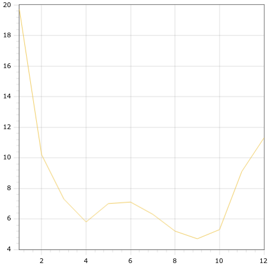
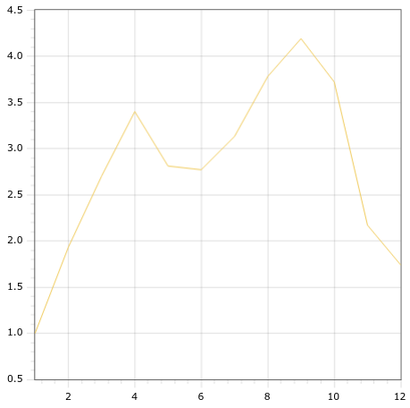
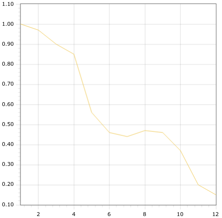

## Федоров Алексей Б20-505
## Национальный исследовательский ядерный университет «МИФИ» (Московский Инженерно–Физический Институт) Кафедра №42 «Криптология и кибербезопасность»

# Лабораторная работа №5: «Технология MPI. Введение»

---

## 2. Описание используемой рабочей среды: модель процессора, объём и тип оперативной памяти, версия и разрядность операционной системы, используемая среда разработки, поддерживаемая ею версия OpenMP;

Для лабораторной работы использовалась среда Jetbrains CLion IDE

Сборка происходит в помощью bash, mpicc и mpirun

Версия MPI

Характеристики компьютера:
- Операционная система: Linux Ubuntu 20.04 x64
- Оперативная память: 16гб
- Процессор: AMD Ryzen 5 4600H with Radeon Graphics 86x
- Количество ядер: 6, обрабатывает в 12 потоков

## 3. Описание хода работы;

1. Для ознакомления с технологией MPI прочитал учебник "А.С.Антонов Параллельное программирование с использованием технологии MPI
2. Скомпилировал исходную программу, посмотрел как работает
3. Добавил код, которые автоматизирует прогон на 10 массивах, замеряет время
4. Сгенерировал массивы размером 100млн элементов
5. Проверил, что программа работает корректно
6. Сделал скрипт для общей автоматизации
7. Прогнал программу на 1млн, 10млн, 100млн элементов, результаты залогировал
8. Построил графики
9. Написал вывод

## 4. Разработанные программные коды;

### [src](https://github.com/ullibniss/parallel-programming-22-23/tree/master/lab5)

## 5. Графики времени работы, ускорения и эффективности для программ на OpenMP и MPI;

Графики и таблица приведены для миллиона элементов

- Времня работы в зависимости от количества потоков

- Ускорение 

- Эффективность

## 6. Заключение: краткое описание проделанной работы.

В этой лабораторной работе я познакомился с технологией MPI. Если сравнивать с openMP, то сразу же хочется отметить, что MPI более комплексная технология

Если сравнивать openMP и MPI с точки зрения бенчмарка, можно сказать:

1) MPI лушче себя показывает при работe с маленьким количеством потоков
2) MPI имеет более не приятный оверхед связанный с операциями распарралеливания, чем openMP

## 7. Таблицы

Количество потоков ->| 1 | 2    | 3     | 4    | 5    | 6    | 7    | 8    |9| 10   | 11  |12
---|---|------|-------|------|------|------|------|------|---|------|-----|---
Среднее время для 10 разный массивов мс | 19,7 | 10.2 | 7.3   | 5.8  | 7.0  | 7.1  | 6.3  | 5.2  | 4.7 | 5.3  | 9.1 | 11.3
Ускорение | 1 | 1,93 | 2,7   | 3,4  | 2,81 | 2,77 | 3,13 | 3,78 | 4,19 | 3,72 | 2,17 | 1,74
Эффективность | 1 | 0,97 |  0,9 |  0,85 | 0,56  | 0,46  | 0,44 | 0,47 | 0,46 | 0,37 | 0,2 | 0,15
