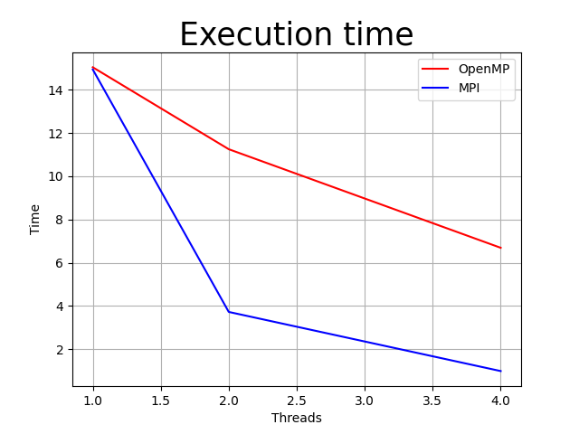
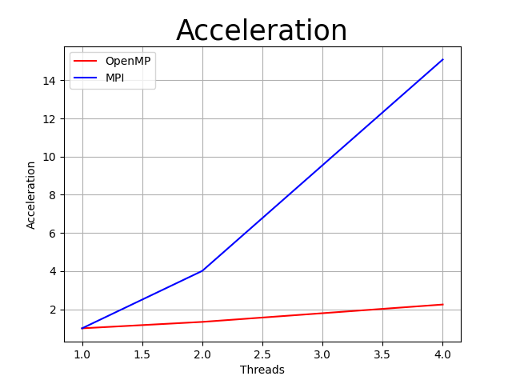
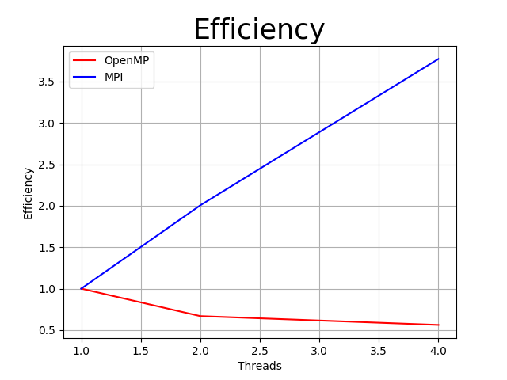

## Федоров Алексей Б20-505
## Национальный исследовательский ядерный университет «МИФИ» (Московский Инженерно–Физический Институт) Кафедра №42 «Криптология и кибербезопасность»

# Лабораторная работа №6: «Коллективные операции в MPI»

---

## 1. Описание используемой рабочей среды: модель процессора, объём и тип оперативной памяти, версия и разрядность операционной системы, используемая среда разработки, поддерживаемая ею версия OpenMP;

Для лабораторной работы использовалась среда Jetbrains CLion IDE

Сборка происходит в помощью CMake

Версия OMP

Характеристики компьютера:
- Операционная система: Linux Ubuntu 20.04 x64
- Оперативная память: 16гб
- Процессор: AMD Ryzen 5 4600H with Radeon Graphics 86x
- Количество ядер: 6, обрабатывает в 12 потоков

## 2. Описание хода работы;

В данной лабораторной работе необходимо было разработать алгоритм сор-
тировки Шелла с помощью технологии MPI и сравнить результаты с ла-
бораторной работой №3, где этот алгоритм разрабатывался с помощью тех-
нологии OpenMP.
Пусть топология коммуникационной сети имеет вид N-мерного гиперку-
ба, то есть количество процессов равно p = 2 N .
Действия алгоритма состоят в следующем:
1. Первый этап: распредление массива на p потоках и выполнение на
каждом из них сортировки Шелла. Распредление массива между p по-
токами реализовывается с помощью процедуры MPI_Scatter(array,
chunk_size, MPI_INTEGER, chunk, chunk_size, MPI_INTEGER,
0, MPI_COMM_WORLD).
2. Второй этап: выполнение операции "compare-split"(сравнить и разде-
лить) для кажой пары процессоров в гиперкубе. Формирование пар
процессоров происходит по правилу - на кажой итерации i, 0 <= i <
N), парными становятся процессоры, у которых различие в битовых
представлении их номеров имеется только в позиции N - i - 1. Вы-
полнение операции "compare-split"(сравнить и разделить) реализовы-
вается с помощью процедуры MPI_Sendrecv(chunk, chunk_size,
MPI_INTEGER, pair, n, tmp_chunk, chunk_size, MPI_INTEGER,
pair, n, MPI_COMM_WORLD, MPI_STATUS_IGNORE). Дан-
ная процедура позволяет избежать тупиковых ситуаций (deadlock).
3. Третий этап: объединение массива с p потоков в главный. Распред-
ление массива между p потоками реализовывается с помощью проце-
дуры MPI_Gather(chunk, chunk_size, MPI_INTEGER, array,
chunk_size, MPI_INTEGER, 0, MPI_COMM_WORLD).
Так как число потоков, которые будут обрабатывать массив определя-
ется на этапе выполнения команды mpirun -np n -q ./prog5, где n — ко-
личество потоков, то для получения экспериментальных результатов был
написан bash-скрипт с циклами.
Для усреднения полученных результатов было расссмотрено 10 случай-
ных массивов, которые сохрнялись файл для получения справедливых ре-
зулльтатов.
Графики сравнения времени, ускорения и эффективности двух различ-
ных технологий параллельного программирования были построены с помо-
щью библиотеки Python matplotlib.

## 3. Графики времени работы, ускорения и эффективности для программ на OpenMP и MPI;

Время:

Ускорение:

Эффективность:

## 5. Заключение: краткое описание проделанной работы.

В результате проделанной лабораторной работы мы получили, что MPI ра-
ботает эффективнее чем OpenMP, несмотря на огромные затраты при пе-
ресылке частей массива с помощью сообщений между процессорами.

## 6. Приложение: разработанные программные коды;

### [src](https://github.com/ullibniss/parallel-programming-22-23/tree/master/lab6)
